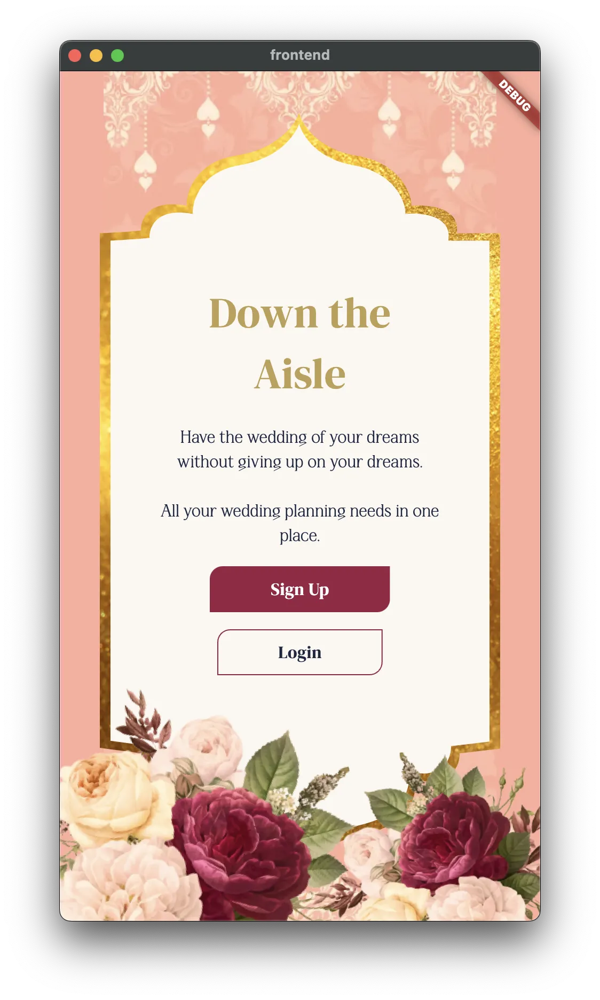
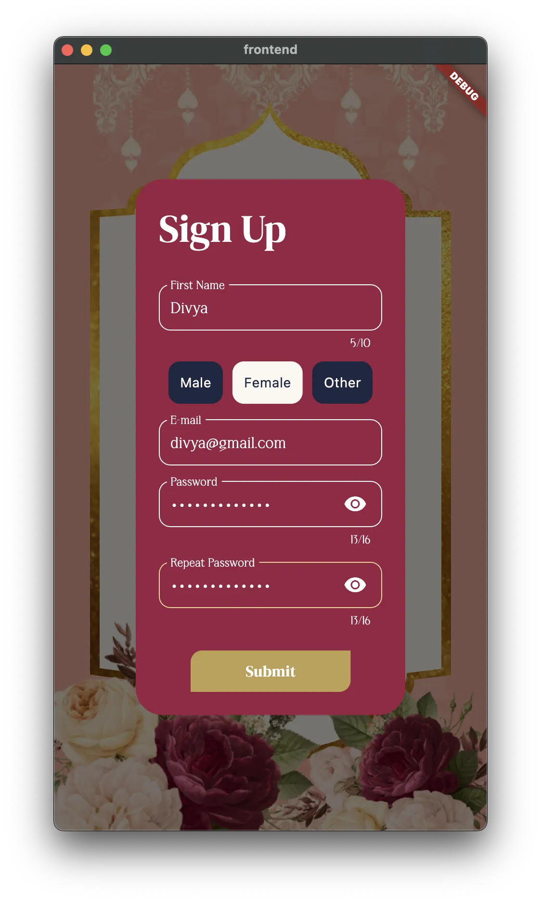
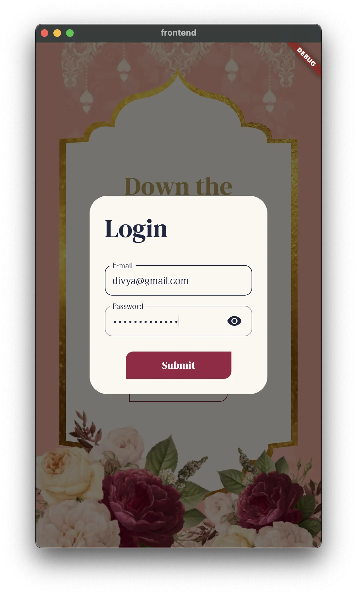
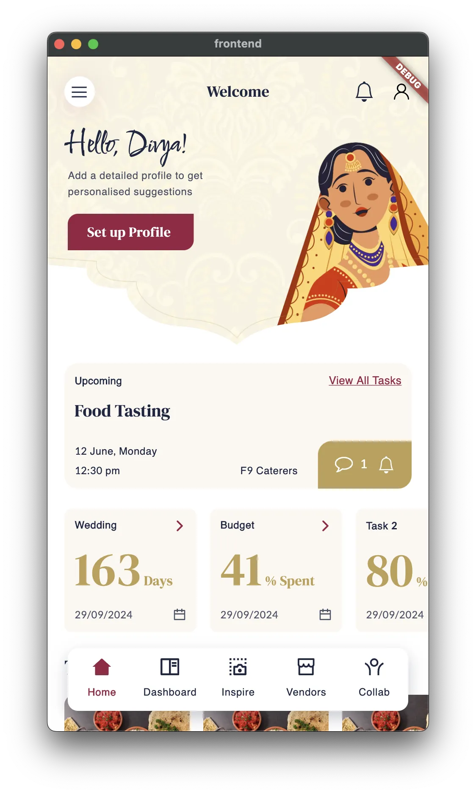
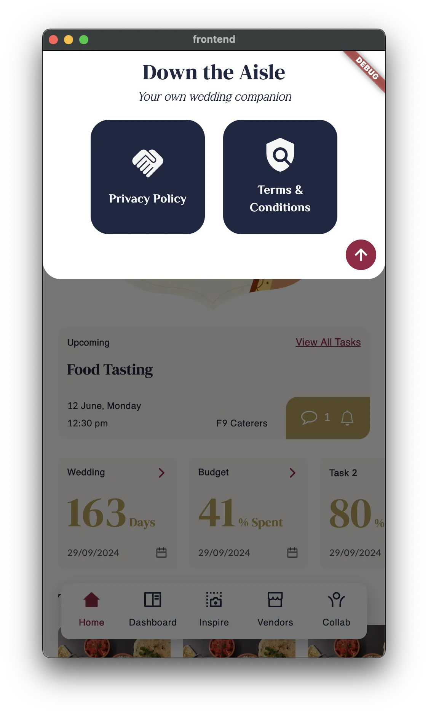
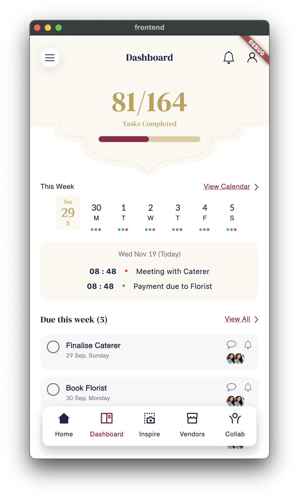
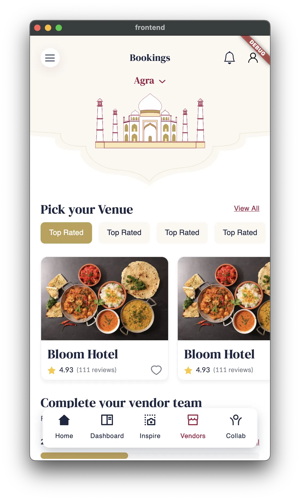

<h1 align="center">Down The Aisle 💍</h1>
<p align="center">A multiplatform wedding planner app that helps you manage all your wedding-related tasks from A to Z 💒</p>

# 🚧 Work In Progress

Please note that `Down The Aisle` is currently a work-in-progress. Due to lack of time in my schedule, only a few preview features have been implemented and deployed for demonstration purposes. The goal is to demonstrate that a multiplatform full-stack system can be written only using the `Dart` ecosystem.

# 🧐 Features

You can check the latest Web deployment of `Down The Aisle` [here](https://shubhamsinghshubham777.github.io/down_the_aisle/)

## 🔐 Authentication

Securely login or sign-up using your credentials

  

## 🔔 Tracking

Get notified about your upcoming events

  

## 🍕 Vendor Management

Pick and choose your favourite vendor teams (food, venue, etc.)



# 🌐 Supported Platforms

The frontend app supports all platforms officially supported by Flutter 🙌🏼🥳

| Android                                        | iOS                                          | macOS                                        | Web                                        | Windows                                        | Linux                                        |
|------------------------------------------------|----------------------------------------------|----------------------------------------------|--------------------------------------------|------------------------------------------------|----------------------------------------------|
|  |  |  |  |  |  |

# 💻 Tech Stack

This is a full-stack repository that contains code for both the `frontend` and `backend` apps. The collective tech-stack is as follows:

| Category                          |                                                    |                                                       |
|-----------------------------------|----------------------------------------------------|-------------------------------------------------------|
| **Programming Language (Common)** |         | [Dart](https://dart.dev)                              |
| **Frontend Framework**            |      | [Flutter](https://flutter.dev)                        |
| **Backend Framework**             |    | [Dart Frog](https://dartfrog.vgv.dev)                 |
| **Database (Backend)**            |     | [Mongo DB](https://www.mongodb.com)                   |
| **CI / CD**                       |       | [GitHub Actions](https://github.com/features/actions) |
| **Version Management (Flutter)**  |          | [FVM](https://fvm.app)                                |
| **Hosting (Frontend Web App)**    |        | [Globe](https://globe.dev)                            |
| **Hosting (Backend App)**         |       | [GitHub Pages](https://pages.github.com)              |

# 👨‍💻 Contribution

Feel free to follow the `README.md` files of both `frontend` and `backend` modules to be able to run this project on your system locally and be able to contribute. All PRs are welcomed 🙌🏼

## 👷 Maintenance

To quickly update the Flutter version used in both `frontend`, `backend`, and `.github/workflows` directories, copy-paste the following command in your terminal:

```sh
chmod +x scripts/change_flutter_version.sh; ./scripts/change_flutter_version.sh NEW_FLUTTER_VERSION
```

where `NEW_FLUTTER_VERSION` is the version you want to upgrade to. For example:

```sh
chmod +x scripts/change_flutter_version.sh; ./scripts/change_flutter_version.sh 3.24.2
```

## ✂️ Common Code Snippets

Generate files (one-time)

```sh
fvm dart run build_runner build --delete-conflicting-outputs
```

Generate files (continuous)

```sh
fvm dart run build_runner watch --delete-conflicting-outputs
```
